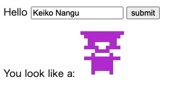

# Dockerの練習
オライリー『Docker』のサンプルコードエラーまとめ。

# Chapter3.3 Dockerfileからcowsayイメージを構築する回
FROMで指定しているベースイメージ[debian](https://www.debian.org/)のバージョンが古いせいでエラーが出た。`wheezy`はサポートが終了しているので、現在の安定版`buster`に変更。

```Dockerfile:Dockerfile
# 誤
FROM debian:wheezy

RUN apt-get update && apt-get install -y cowsay fortune

# 正
FROM debian:buster

RUN apt-get update && apt-get install -y cowsay fortune
```

この`Dockerfile`からビルドした`cowsayイメージ`の実行コマンドもパスが通っていないとエラーが返ってくる。

```terminal:terminal
$ # 誤
$ docker run test/cowsay-dockerfile "Moo"
docker: Error response from daemon: OCI runtime create failed:
container_linux.go:367: starting container process caused: exec: "Moo": executable file not found in $PATH: unknown.

$ # 正
$ docker run test/cowsay-dockerfile /usr/games/cowsay "Moo"
 _____
< Moo >
 -----
        \   ^__^
         \  (oo)\_______
            (__)\       )\/\
                ||----w |
                ||     ||
```

# Chapter5.1 "Hello, World!"出力する回
そのまま書き写すと、2行目で`IndentationError`が出る。`Python`は括弧(){}の代わりにインデントでコードをグルーピングする言語なので、タブ・スペースのズレは気を付けないといけない。

```python:identidock.py
# 誤
from flask import Flask
    app = Flask(__name__)  #ここのインデント
 
@app.route('/')
def hello_world():
    return 'Hello World!\n'
 
if __name__ == '__main__':
    app.run(debug=True, host='0.0.0.0')

# 正
from flask import Flask
app = Flask(__name__)
 
@app.route('/')
def hello_world():
    return 'Hello World!\n'
 
if __name__ == '__main__':
    app.run(debug=True, host='0.0.0.0')
```

# Chapter5.1 "Hello, World!"出力する回 その2
コンテナにアプリケーションサーバ[uWSGI(Web Server Gateway Interface)](https://uwsgi-docs.readthedocs.io/en/latest/)を導入する際、サンプルの通り古いバージョンを指定してしまうとエラーが出る。最新版の2.0.19に直す。

```Dockerfile:Dockerfile
# 誤
FROM python:3.4

RUN pip install Flask==0.10.1 uWSGI==2.0.8
WORKDIR /app
COPY app /app/

CMD ["uwsgi", "--http", "0.0.0.0:9090", "--wsgi-file", "/app/identidock.py", \ "--callable", "app", "--stats", "0.0.0.0:9191"]

# 正
FROM python:3.4

RUN pip install Flask==0.10.1 uWSGI==2.0.19
WORKDIR /app
COPY app /app/

CMD ["uwsgi", "--http", "0.0.0.0:9090", "--wsgi-file", "/app/identidock.py", \ "--callable", "app", "--stats", "0.0.0.0:9191"]
```

# おまけ その１
せっかくDocker版[cowsay](https://ja.wikipedia.org/wiki/Cowsay)を起動したので、cow以外のcowsayを出力させてみた。

```terminal:terminal
$ docker run -it --name cowsay --hostname cowsay debian bash #インタラクティブセッションを要求

root@cowsay:/# apt-get update
root@cowsay:/# apt-get install -y cowsay fortune
root@cowsay:/# /usr/games/fortune | /usr/games/cowsay -l #-lオプションでcow以外のファイルを確認

Cow files in /usr/share/cowsay/cows:
apt bud-frogs bunny calvin cheese cock cower daemon default dragon
dragon-and-cow duck elephant elephant-in-snake eyes flaming-sheep
ghostbusters gnu hellokitty kangaroo kiss koala kosh luke-koala
mech-and-cow milk moofasa moose pony pony-smaller ren sheep skeleton
snowman stegosaurus stimpy suse three-eyes turkey turtle tux unipony
unipony-smaller vader vader-koala www

root@cowsay:/# /usr/games/fortune | /usr/games/cowsay -f dragon #-fオプションで選択
 _________________________________________
/ Truth will out this morning. (Which may \
\ really mess things up.)                 /
 -----------------------------------------
      \                    / \  //\
       \    |\___/|      /   \//  \\
            /0  0  \__  /    //  | \ \    
           /     /  \/_/    //   |  \  \  
           @_^_@'/   \/_   //    |   \   \ 
           //_^_/     \/_ //     |    \    \
        ( //) |        \///      |     \     \
      ( / /) _|_ /   )  //       |      \     _\
    ( // /) '/,_ _ _/  ( ; -.    |    _ _\.-~        .-~~~^-.
  (( / / )) ,-{        _      `-.|.-~-.           .~         `.
 (( // / ))  '/\      /                 ~-. _ .-~      .-~^-.  \
 (( /// ))      `.   {            }                   /      \  \
  (( / ))     .----~-.\        \-'                 .~         \  `. \^-.
             ///.----..>        \             _ -~             `.  ^-`  ^-_
               ///-._ _ _ _ _ _ _}^ - - - - ~                     ~-- ,.-~
                                                                  /.-~


root@cowsay:/# /usr/games/fortune | /usr/games/cowsay -f tux   
 _______________________________________
/ He was part of my dream, of course -- \
| but then I was part of his dream too. |
|                                       |
\ -- Lewis Carroll                      /
 ---------------------------------------
   \
    \
        .--.
       |o_o |
       |:_/ |
      //   \ \
     (|     | )
    /'\_   _/`\
    \___)=(___/
```

# おまけ その2
ポケモンバージョンの[Pokemonsay in Docker](https://github.com/xaviervia/docker-pokemonsay)があったので、やってみた。

```terminal:terminal
$ docker run --rm -it xaviervia/pokemonsay 'Hello World!'
```
ランダムでポケモンが出てきた。かわいい:fire:<br>


# Chapter6 シンプルWebアプリケーションを作成する回
第5章と同じく、Pythonファイルのインデントと導入するライブラリのバージョンに気を付けないとエラーが出る。あと`redis`と`radis`のスペルミス沼にハマってしまった。<br>

```Dockerfile:Dockerfile
# 誤
RUN pip install Flask==0.10.1 uWSGI==2.0.19 requests==2.0.8 redis==2.5.1

# 正
RUN pip install Flask==0.10.1 uWSGI==2.0.19 requests==2.10.0 redis==3.0.0
```

```yml:docker-composer.yml
# 誤
redis:
    image: redis:3.0

# 正
redis:
    image: redis:latest
```
ちなみに`Dockerfile`と`docker-composer.yml`でライブラリのバージョン表記が違うのは、前者はPython用のクライアントライブラリ、後者はコンテナ(サービス)とそれぞれインストールしているものが違うから。<br>
入力情報から一意にモンスターを生成してくれるAPI[dnmonster](https://github.com/amouat/dnmonster)を使用したサンプルでした。かわいい:space_invader:<br>


# 参考

https://www.oreilly.co.jp/books/9784873117768/
